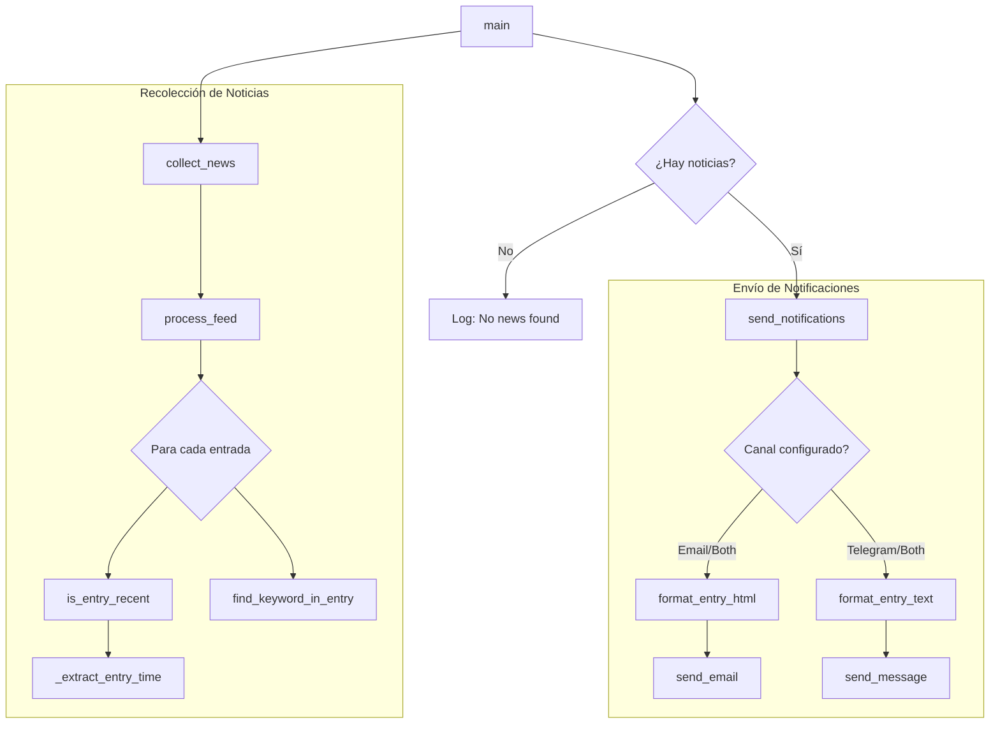

# Lógica y Arquitectura de News Reader Improved

Este documento describe el flujo de ejecución y la estructura lógica del script `news_reader_improved.py`. Debido a su diseño modular, el proceso se divide en funciones especializadas que colaboran para obtener, filtrar y notificar noticias.

## Diagrama de Flujo de Llamadas

El siguiente diagrama muestra cómo las funciones interactúan entre sí, desde el punto de entrada `main()` hasta las funciones auxiliares de bajo nivel.

## Descripción del Flujo Paso a Paso

### 1. Orquestación Principal (`main`)
La función `main` es el director de orquesta. Su única responsabilidad es coordinar las dos fases principales:
1.  **Recolección**: Llama a `collect_news()` para obtener una lista de noticias interesantes de todos los feeds.
2.  **Notificación**: Si se encontraron noticias, llama a `send_notifications()` para enviarlas a los usuarios.

### 2. Fase de Recolección (`collect_news`)
Esta función itera sobre todos los feeds definidos en la configuración (`config.FEEDS`).
-   Para cada feed, llama a `process_feed`.
-   Recibe una lista de noticias de ese feed.
-   Realiza una **deduplicación** basada en el título de la noticia para evitar repetir la misma historia si aparece en múltiples fuentes.
-   Acumula todas las noticias únicas en una lista maestra.

### 3. Procesamiento de Feeds (`process_feed`)
Esta función se encarga de un solo feed RSS.
-   Descarga y parsea el feed usando `feedparser`.
-   Itera sobre cada entrada del feed.
-   **Filtro de Tiempo**: Llama a `is_entry_recent` para ver si la noticia es nueva (según `config.HOURS_AGO`).
    -   `is_entry_recent` a su vez usa `_extract_entry_time` para normalizar la fecha de la noticia a UTC.
-   **Filtro de Palabras Clave**: Si es reciente, llama a `find_keyword_in_entry` para ver si el título o resumen contiene alguna de las palabras clave (`config.KEYWORDS`).
-   Devuelve solo las entradas que pasaron ambos filtros.

### 4. Fase de Notificación (`send_notifications`)
Recibe la lista de noticias interesantes y decide cómo enviarlas basándose en `config.NOTIFICATION_CHANNEL`.

-   **Para Email**:
    -   Convierte cada noticia a un bloque HTML bonito usando `format_entry_html`.
    -   Junta todos los bloques en un solo cuerpo de correo.
    -   Envía un único correo resumen usando `send_email`.

-   **Para Telegram**:
    -   Itera sobre cada noticia.
    -   Convierte la noticia a un mensaje de texto simple usando `format_entry_text`.
    -   Envía un mensaje individual por cada noticia usando `send_message`.

## Resumen de Funciones Auxiliares

*   **`_extract_entry_time`**: Normaliza fechas de diferentes formatos RSS a un objeto `datetime` UTC estándar. Es crucial para comparar tiempos correctamente.
*   **`is_entry_recent`**: Lógica booleana simple: ¿La fecha de la noticia es mayor que (ahora - X horas)?
*   **`find_keyword_in_entry`**: Busca strings dentro de strings (case-insensitive).
*   **`format_entry_html` / `format_entry_text`**: Plantillas de presentación. Separan los datos (la noticia) de su representación visual (HTML o Texto).
